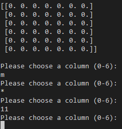

# Python Connect4

Python Connect4 is a python terminal implementation of the classic connect 4 game.
It runs in the [Code Institue](https://codeinstitute.net/all-access-coding-challenge/?utm_term=code%20institute&utm_campaign=CI+-+IRL+-+Search+-+Brand&utm_source=adwords&utm_medium=ppc&hsa_acc=8983321581&hsa_cam=14304747355&hsa_grp=128775288209&hsa_ad=539453915484&hsa_src=g&hsa_tgt=kwd-319867646331&hsa_kw=code%20institute&hsa_mt=e&hsa_net=adwords&hsa_ver=3&gclid=CjwKCAiAv_KMBhAzEiwAs-rX1PXOCAky8yjljHzgvSnccpkyUOvNLVGMuzG11t86weTdFdPiTfNHHhoCFuwQAvD_BwE) mock terminal on [Heroku](https://id.heroku.com/login).

The user can play a connect four game against the computer.

[Try it out here (Link to external site)](https://connect4-python.herokuapp.com/)


## How to play

Python Connect4 is based on the classic tabletop game connect 4.

* Connect Four (also known as Four Up, Plot Four, Find Four, Captain's Mistress, Four in a Row, Drop Four, and Gravitrips in the Soviet Union) is a two-player connection board game, in   which the players choose a color and then take turns dropping colored discs into a seven-column, six-row vertically suspended grid. The pieces fall straight down, occupying the lowest available space within the column. The objective of the game is to be the first to form a horizontal, vertical, or diagonal line of four of one's own discs. Connect Four is a solved game. The first player can always win by playing the right moves. The game was first sold under the Connect Four trademark[3] by Milton Bradley in February 1974. [Wikipedia, 2021](https://en.wikipedia.org/wiki/Connect_Four)

## Features

### **Existing Features**

* Input validation error checking
  * Player cannot enter a letter or symbol and must enter a number greater than `0` and less than the amount of columns.



* Play against computer
* Accepts user input
* Maintains scores


* Computer thinking animation to give user the feeling of playing against a real player.


* Piece dropping animation. Without this it is hard for the user to see that they are playing connect four.


### **Future Features**

* Give the computer a more advanced decision making algorithm.
* Create computer predictability so that the user can learn the computer move pattern.
* Display board and pieces in a cleaner way.
* Allow user to have choice of which piece they have.
* Coin toss for who starts (Important because there are patterns where the user that is first always wins).

## Data Model

I decided to use a board class as my model. The game creates an instance of the board when the game starts.

The board class stores the board, size and if the game is currently playing. The board also has moethpds to help play the game. Such as a `print_board` method to print out the current board. A `valid_drop` method to check if there is space in the chosen column and what row that space is. A `dropping_piece` method to create a print animation to drop the piece into the board.

## Testing

I have manually tested this project by doing the following:
* Passed the code through [PEP8](http://pep8online.com/checkresult) linter and confirmed there are no warnings or errors.
* Given invalid inputes: strings when numbers are expected, out of bounds inputs, the same input twice.
* Tested in both local and deployed terminals.

## Bugs

### **Solved Bugs**

#### **Win conditions**
* When creating the 'check_win' function I was getting out of bounds in array errors for some win conditions. I noticed this would be because to check
if the user has won the conditions had row + 1, row + 2 and row + 3 ( with the same for columns). If the board position was `(5, 3)` then row +3 would cause the final value of 
8 to be greater than the actual number of rows available to check. My first idea for a fix was just to add:
```python
    if (row + 3) <= 6:
        # Check for wins
```
* I soon figured out that this does not work as some column win conditions would have a row element that would be out of bounds if 3 is added.
```python
    for c in range(self.col_count-3):
            for r in range(self.row_count):
                if (b[r][c] == piece and
                    b[r][c+1] == piece and
                        b[r][c+2] == piece and
                        b[r][c+3] == piece):
                    return True
```
* I finally settled for this approach after **many** different attempts at this problem. This method has 4 code blocks in the check win function. One for vertical win, one for horixontal win and two for the positive and negative diagonals.

#### **Working backwards**
* At the beginning of this project I found it difficult to work with the board as the first piece would be at say `(0,6)` instead of `(0,0)`. 
This was solved by working with the board in the postion where `(0,0)` is the bottom and then flipping it to display to the user at the end.
```python
    def display_upsidedown_board(self):
            """
            Prints the upside down and flipped board array so pieces at 0,0
            are at the bottom.
            """
            print(f'\n{np.flip(self.board, 0)}\n')
```

### **Remaining Bugs**

* User can send an input when the computer is choosing and placing the piece. This does not break the game as the user choice is still sent and displayed. A fix could be some sort of await function after the user sends one input.

## Validator Testing
* PEP8
  * No errors returned from [PEP8online.com](PEP8online.com)

## Deployment
This project was deployed using Code Institute's mock terminal for Heroku.

* Steps for deployment:
  * Fork or clone this repository
  * Create new Heroku app
  * Set the buildbacks to `Python` and `NodeJS` in that order
  * Link the Heroku app to the repository
  * Click on `Deploy`

## Credits
* [Code Institute](https://codeinstitute.net/all-access-coding-challenge/?utm_term=code%20institute&utm_campaign=CI+-+IRL+-+Search+-+Brand&utm_source=adwords&utm_medium=ppc&hsa_acc=8983321581&hsa_cam=14304747355&hsa_grp=128775288209&hsa_ad=539453915484&hsa_src=g&hsa_tgt=kwd-319867646331&hsa_kw=code%20institute&hsa_mt=e&hsa_net=adwords&hsa_ver=3&gclid=CjwKCAiAv_KMBhAzEiwAs-rX1PXOCAky8yjljHzgvSnccpkyUOvNLVGMuzG11t86weTdFdPiTfNHHhoCFuwQAvD_BwE) for the deployment terminal and the formatting for this MarkDown document.

* [Wikipedia](https://en.wikipedia.org/wiki/Connect_Four) for details on Connect Four game.

* [Geoffrey Mariette](https://medium.com/@geoffrey.mariette/crazy-connect4-with-python-146d384f4cfb) for article on Python Connect Four.